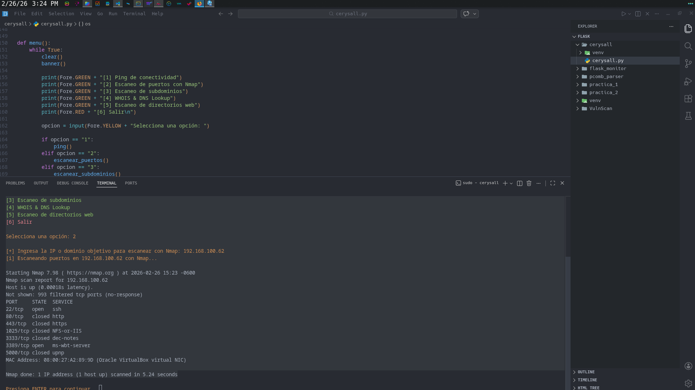
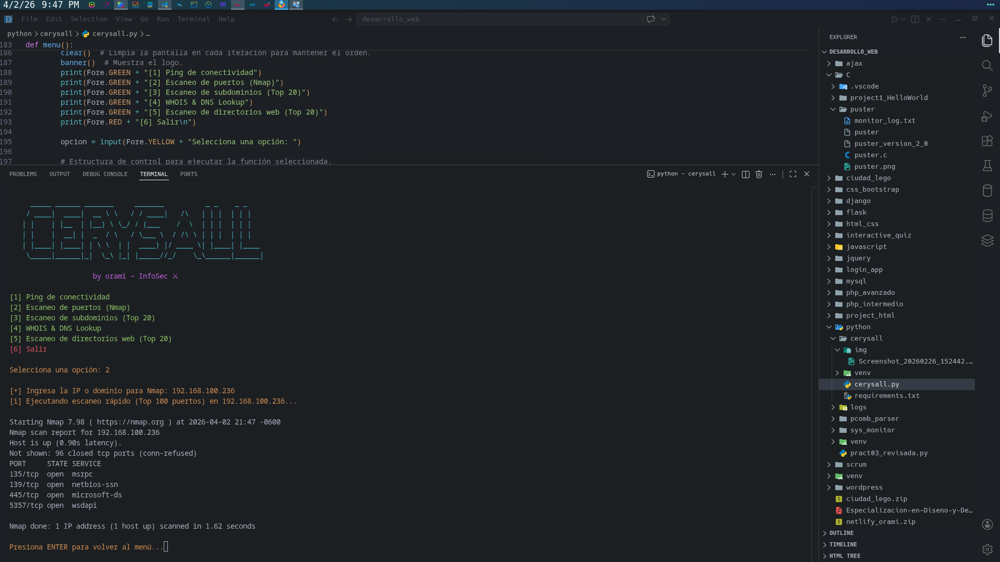
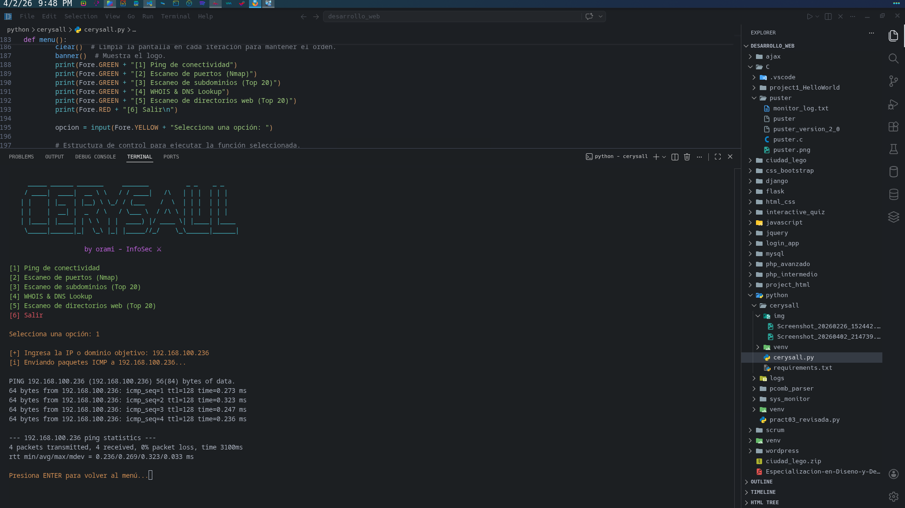
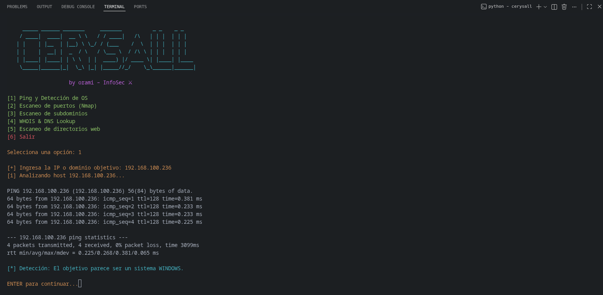
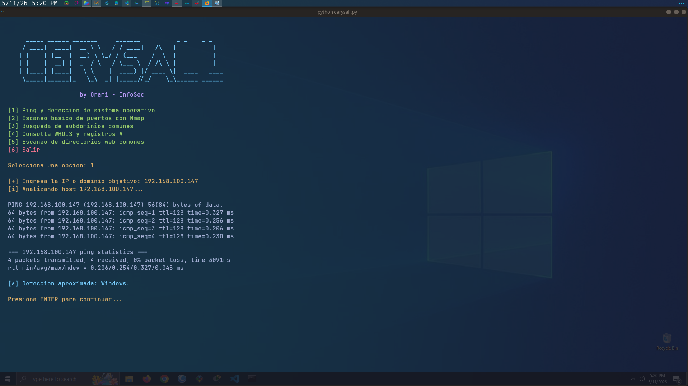
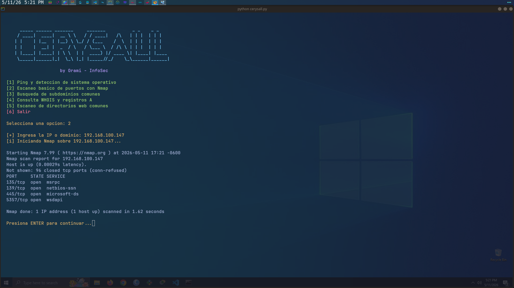

# Cerysall

Cerysall es una herramienta de consola escrita en Python para practicar tareas básicas de reconocimiento de red y web.

## Screenshots








## Funciones

- Ping con detección básica de sistema operativo por TTL.
- Escaneo rápido de puertos con `nmap`.
- Búsqueda de subdominios comunes.
- Consulta `WHOIS` y registros `A`.
- Revisión básica de directorios web frecuentes.

## Requisitos

- Python 3.11 o superior
- `nmap` instalado en el sistema para la opción de escaneo de puertos

## Instalación

```bash
python3 -m venv .venv
source .venv/bin/activate
pip install -r requirements.txt
```

## Ejecución

```bash
python cerysall.py
```

## Estructura

- `cerysall.py`: archivo principal del proyecto.
- `requirements.txt`: dependencias de Python.
- `img/`: capturas opcionales del proyecto.

## Nota

Este proyecto está pensado para aprendizaje y práctica en entornos controlados.
